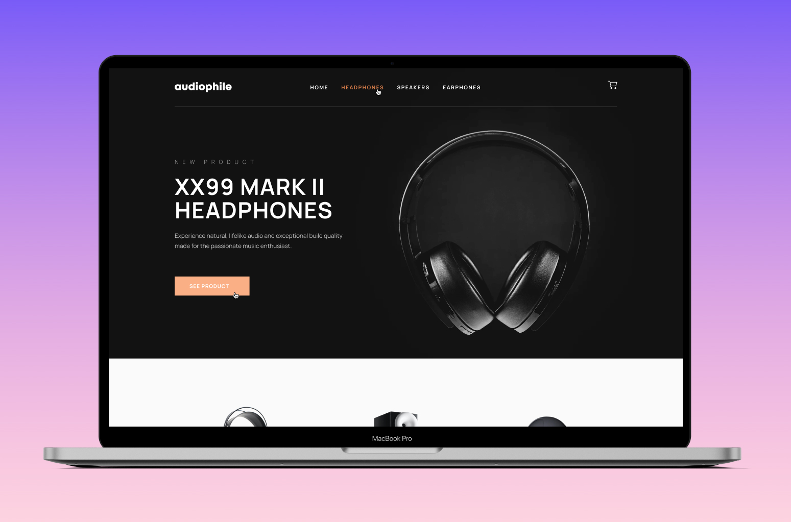

# Welcome! My name is _Chris_ and this is my portfolio website 🚀.

The website showcases what I have done in the past, what I'm doing now and my plan for the future.

## Here is the website structure

1. Header
2. Main
   1. Hero section
   2. Projects section
   3. Development tools
   4. About me
   5. Contact
3. Footer

## Some project screenshots

## Technologies I used

1. React for builing UI
2. Styled components for styling
3. Vercel for deploying.

Besides above technologies, I used some other helpful libraries such as:

- `react-scroll` for smooth scrolling to each sections of the website.
- `react-toastify` for beautiful, elegant and reusable Toast component.

## Run the project in your local machine

1. Clone the project by using `git clone https://github.com/chrisdev188/personal-portfolio.git`
2. Navigate to the project folder and run `npm install` to install project dependencies.
3. Then run `npm run dev` to open project in your local browser.
